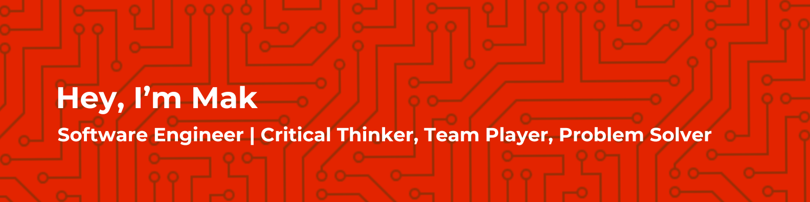

  💻 Frontend Developer | 🧠 Lifelong Learner | ⚡ Performance Enthusiast

---

### 🚀 About Me

I'm a Frontend Developer with 4+ years of experience building fast, scalable, and accessible web applications. I focus on crafting intuitive digital experiences using modern tools and frameworks like:

- ⚛️ **React**, **Next.js**, **TypeScript**
- 🎨 **Tailwind CSS**, **SCSS**, **BEM**
- 📡 REST APIs, Firebase, Stripe
- 🚀 Performance optimization, SEO, responsive design
- 🛠 Git, GitHub, Vercel, Agile workflows

I enjoy building things that solve real-world problems and collaborating on open-source and freelance projects.

---

### 🔧 Tech Stack

---

### 📫 Connect With Me

- 🌍 Website: [https://findmak.com](https://findmak.com)  
- 💼 LinkedIn: [linkedin.com/in/mak-ibrahim](https://linkedin.com/in/mak-ibrahim/)  
- 🧠 Portfolio & case studies available on my site!

---

Thanks for visiting my GitHub! Let’s build something amazing together.

